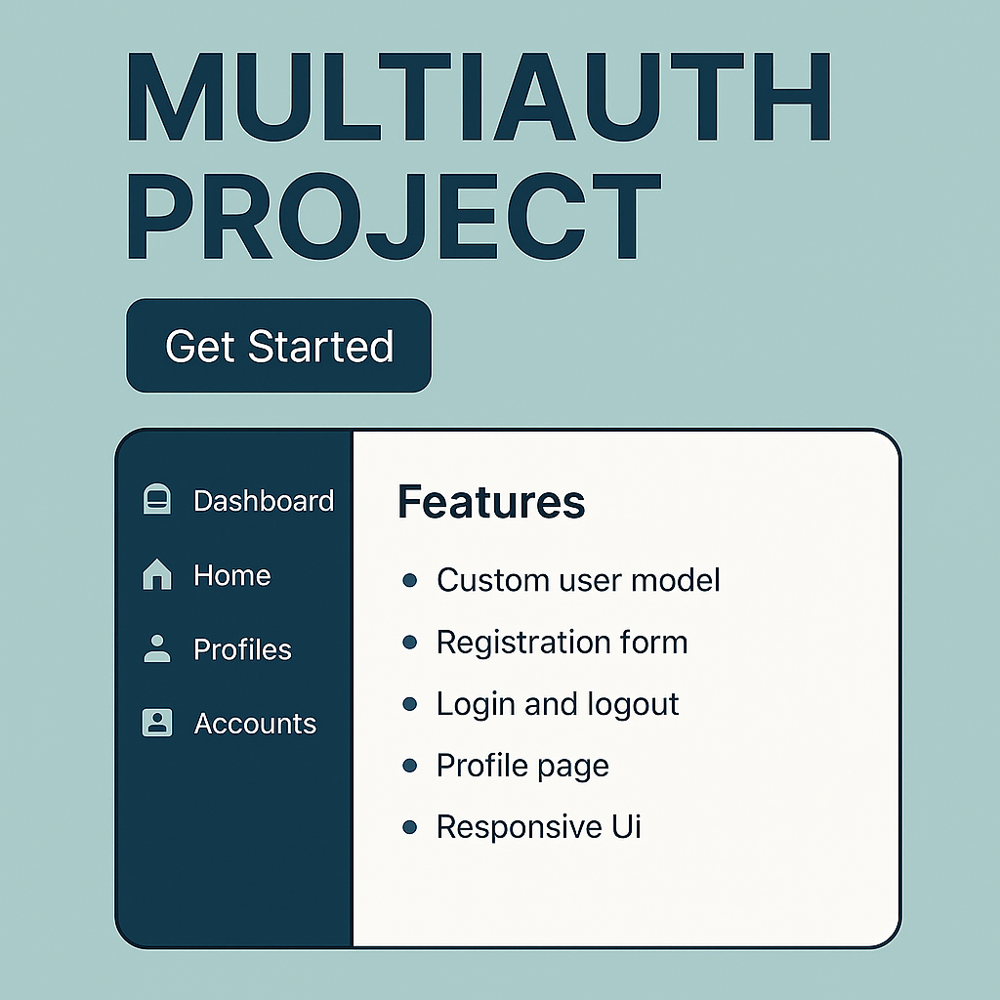

<p align="center">
  
</p>

# <h1 align="center"> MultiAuth Django Project </h1>

A Django web application implementing multi-app user authentication and profile management with a custom user model.

---

## Table of Contents

- [Project Overview](#project-overview)
- [Features](#features)
- [Project Structure](#project-structure)
- [Installation & Setup](#installation--setup)
- [Usage](#usage)
- [Key Configurations](#key-configurations)
- [URLs and Views](#urls-and-views)
- [Templates](#templates)
- [Future Improvements](#future-improvements)
- [Credits](#credits)
- [License](#license)

---

## Project Overview

This project demonstrates a multi-app Django architecture for user authentication and profile management.  
It includes separate apps for:

- `accounts` - Handles user registration, login, logout with a custom User model.  
- `home` - Provides the landing home page.  
- `profiles` - Allows logged-in users to view their profile details.

The project uses a custom User model with email as the username field and supports roles like student, staff, faculty, and admin.

---

## Features

- Custom user model with email login and role-based fields  
- Registration form with role-specific fields validation (e.g., level and term for students)  
- Login and logout with session management  
- Profile page for authenticated users  
- User-friendly and responsive HTML templates with messaging and validation  
- Password hashing and security best practices via Django  
- Modular app structure with clean separation of concerns  
- SQLite database for easy setup and development

---

## Project Structure

```

multiauth\_project/
├── accounts/          # User auth app with models, views, urls, admin
├── home/              # Home app with landing page
├── profiles/          # Profiles app with profile view
├── multiauth\_project/ # Project settings and URL configurations
├── templates/         # HTML templates for all apps
│   ├── accounts/      # login.html, register.html
│   ├── home/          # index.html
│   ├── profiles/      # profile.html
│   └── base.html      # Base template for all pages
├── static/            # Static files like CSS, JS, images
├── db.sqlite3         # SQLite database file
└── manage.py          # Django management command-line utility

```

---

## Installation & Setup

1. Clone the repository:

```
git clone <repository-url>
cd multiauth_project
```

2. Create and activate a virtual environment:

```
python -m venv venv
source venv/bin/activate  # Linux/macOS
venv\Scripts\activate     # Windows
```

3. Install dependencies (add `requirements.txt` if needed):

```
pip install django
```

4. Apply migrations:

```
python manage.py migrate
```

5. Create a superuser for admin access:

```
python manage.py createsuperuser
```

6. Run the development server:

```
python manage.py runserver
```

7. Access the app at `http://127.0.0.1:8000/`

---

## Usage

* Visit the home page (`/`)
* Register a new user via `/accounts/register/`
* Login via `/accounts/login/`
* View user profile at `/profiles/profile/` (login required)
* Logout via `/accounts/logout/`

---

## URLs and Views

* `accounts/urls.py`:

  * `register/` → `RegisterView` (handles GET and POST registration)
  * `login/` → `LoginView` (handles GET and POST login)
  * `logout/` → `logout_view` (logs out the user)

* `home/urls.py`:

  * `/` → `index` view rendering home page

* `profiles/urls.py`:

  * `profile/` → `profile_view` (login required, shows user profile)

---

## Templates

* `base.html`: Base layout with navigation and messaging system
* `accounts/login.html`: Login form with validation messages
* `accounts/register.html`: Registration form with role-specific fields and password confirmation
* `home/index.html`: Welcome page showing user status
* `profiles/profile.html`: Displays user details and logout option

All templates use simple CSS styling and Django messages framework for user feedback.

---

## Future Improvements

* Add password reset and email verification flows
* Support social authentication (Google, Facebook)
* Enhance user profiles with editable fields and avatars
* Add user role-based permissions and admin dashboards
* Replace SQLite with PostgreSQL for production
* Improve frontend with Bootstrap or Tailwind CSS

---

# Credits

Built with Django by **Md Tahsin Azad Shaikat**

CSE Undergraduate | Backend Developer | Robotics & IoT Enthusiast

🔗 [LinkedIn](https://www.linkedin.com/in/mdtahsinazad020/)

🐙 [GitHub](https://github.com/shaikat020)

Assisted by **Md Rakibul Hassan**

CSE Undergraduate | Backend Developer | Robotics & IoT Enthusiast

🔗 [LinkedIn](https://www.linkedin.com/in/md-rakibul-hassan-507b00308)

🐙 [GitHub](https://github.com/RR0327)

Designed to help users visualize complex data through customizable heatmaps and track real-time weather conditions interactively. 

# License

This project is open source and available under the MIT License.
---

Thank you for using this project!
Feel free to customize and expand it according to your needs.
